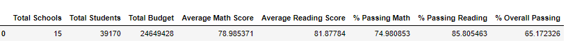
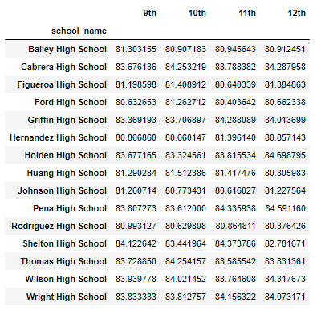
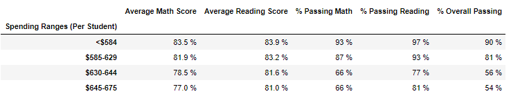

# School_District_Analysis
## Overview 
In this challenge an analysis of the data with the help of the Pandas library in Python, of an entire School District was performed, in order to obtain the funding and students grades per school and visualize the top performing schools. Additionally, to uphold state-testing standars, the analysis was performed twice due to potential academic dishonesty of the 9th graders of the Thomas High School.

## Results
Due to the potential academic dishonesty of the 9th graders of the Thomas High School, the entire 9th grade results for math and reading scores were replaced by NaNs and where ommited in the calculation of the passing percentage of the School District. The dataframe below shows a comparisson in the results of the School District averages in each assigment.

District Summary (before)   |  District Summary
:-------------------------:|:-------------------------:
    | 

After replacing the math and reading scores of the 9th graders in Thomas High School we got these results:
* The overall passing percentage for Thomas High School fell from 90.94%  to 65.07%
* The overall passing percentage for the School District dropped from 65.17% to 64.9%
* Thomas High School was no longer part of the top 5 schools.

The percentages of passing students in Thomas High School were also affected:
* The overall passing percentages decreased 25.87%
* The passing reading percentage decreased 27.64%
* The passing math percentage decreased 26.36%

The math and reading scores before and after we changed the 9th graders:
### Before cleaning the data
Math scores   |  Reading scores
:-------------------------:|:-------------------------:
    | 

### After cleaning the data
Math scores   |  Reading scores
:-------------------------:|:-------------------------:
    |  

### Scores per spending ranges
It was found that the average scores and passing percentages did not increase as spending per student increases since the top performing school in both analysis "Cabrera High School" has a smaller per student budget than the worst performing schools. As we can see in the image below, there was only a change in the range "$630-644".

Spending ranges scores (before)   |  Spending ranges scores 
:-------------------------:|:-------------------------:
    |  

### Scores per school size
Next we performed the analysis for the school size and since "Thomas High School" is a medium size school we got that only the range of 1000-2000 students changed its results as shown in the image below.
School size scores (before)   |  School size scores 
:-------------------------:|:-------------------------:
    | 

### Scores per school type
Finally an analysis of the type of school was performed. The school type charter results are changed because the "Thomas High School" type is charter as shown in the images below.
School type scores (before)   |  School type scores 
:-------------------------:|:-------------------------:
    | 

## Summary
The four main changes we can see when excluding the 9th grade math and reading scores for Thomas High School are the following:

* The decrease of the overall passing percentage of the school by almost 26%.
* There is a small schange in the overall passing percentage of the school district, this value is not massively affected because of the quantity of students in the district.
* The scores by spending ranges decreases only in the range "$630-644" meaning that is the spending budget per student in "Thomas High School"
* The scores per school size changed in the medium size range (1000-2000) because ghthe size of the "Thomas High School" is medium.
